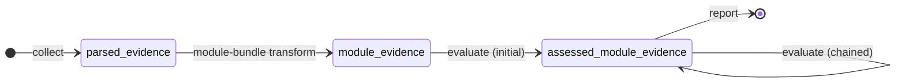
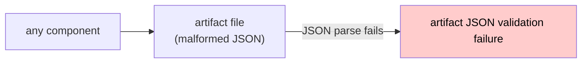
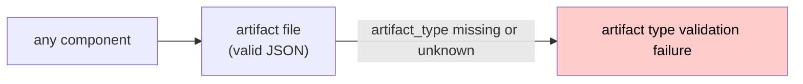
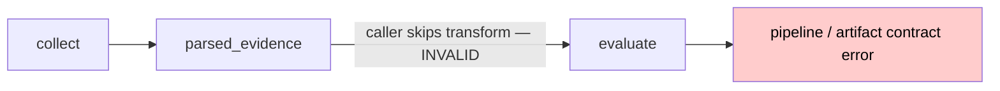
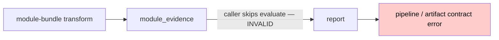
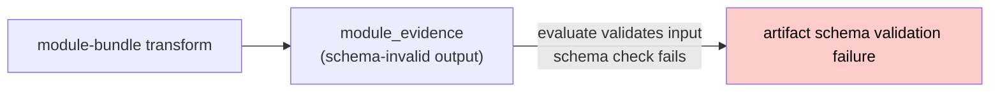
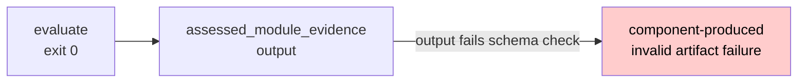
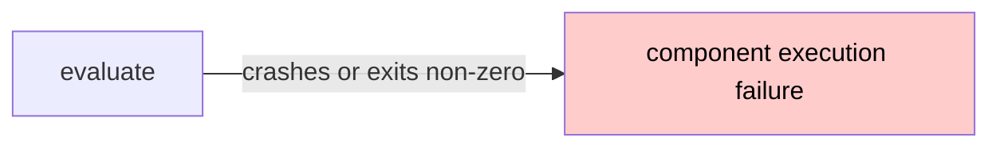

# Artifact Stage Contract

This document defines the artifact stages used by the Testography pipeline, the read and write permissions of each pipeline component, valid stage transitions, and the error classes reached by invalid transitions.

## Artifact Stages

### `parsed_evidence`

Parser output. Contains primary evidence produced by the parser.

Fields:

- `artifact_type`: `"parsed_evidence"`
- `evidence`: parser-produced test cases, modules, and test-module links

### `module_evidence`

Module-bundle transform output. Preserves parser-produced `evidence` and adds transform-produced `module_bundles` at the artifact top level.

Fields:

- `artifact_type`: `"module_evidence"`
- `evidence`: preserved parser-produced evidence
- `module_bundles`: transform-produced module-centered derived data

### `assessed_module_evidence`

Evaluator output and reporter input. Preserves parser-produced `evidence`, transform-produced `module_bundles`, and adds evaluator-produced `assessment_layers` at the artifact top level.

Fields:

- `artifact_type`: `"assessed_module_evidence"`
- `evidence`: preserved parser-produced evidence
- `module_bundles`: preserved transform-produced module-bundle data
- `assessment_layers`: evaluator-produced assessment data

`assessed_module_evidence` does not use a nested `module_evidence` wrapper. All staged fields are at the artifact top level.

## Component Read/Write Permissions

| Component              | Reads                                              | Writes                    |
|------------------------|----------------------------------------------------|---------------------------|
| `collect`              | —                                                  | `parsed_evidence`         |
| module-bundle transform| `parsed_evidence`                                  | `module_evidence`         |
| `evaluate`             | `module_evidence`, `assessed_module_evidence`      | `assessed_module_evidence`|
| `report`               | `assessed_module_evidence`                         | —                         |

## Valid Artifact-Stage Transitions

### Evaluator chaining

Multiple evaluators may be applied sequentially. Each evaluator reads the `assessed_module_evidence` produced by the previous evaluator, appends its assessment layer, and writes a new `assessed_module_evidence`. Existing `assessment_layers` are preserved and never overwritten.

## Invalid Transitions and Error Classes

The following table summarises invalid artifact-stage paths and the error class they produce.

| Path                                                        | Error class                              |
|-------------------------------------------------------------|------------------------------------------|
| `parsed_evidence` reaches `evaluate`                        | Pipeline / artifact contract error       |
| `parsed_evidence` reaches `report`                          | Pipeline / artifact contract error       |
| `module_evidence` reaches `report`                          | Pipeline / artifact contract error       |
| `assessed_module_evidence` reaches module-bundle transform  | Pipeline / artifact contract error       |
| Artifact JSON is malformed                                  | Artifact JSON validation failure         |
| Artifact `artifact_type` is missing or unknown              | Artifact type validation failure         |
| Artifact fails JSON Schema validation for its `artifact_type`| Artifact schema validation failure      |
| Component exits with a non-zero exit code                   | Component execution failure              |
| Component produces a schema-invalid artifact                | Component-produced invalid artifact failure |

### Error class definitions

**Pipeline / artifact contract error**
An artifact of a stage that the receiving component does not accept has been passed to that component. This is a caller or orchestration error, not a defect in the component itself. The component must reject the artifact without processing it.

**Artifact JSON validation failure**
The artifact file cannot be parsed as JSON.

**Artifact type validation failure**
The artifact parses as valid JSON but the `artifact_type` field is missing or does not match any known artifact stage. This is distinct from a JSON parsing error because the file is well-formed; the pipeline simply cannot determine which stage the artifact belongs to.

**Artifact schema validation failure**
The artifact parses as JSON and has a known `artifact_type`, but its structure does not conform to the JSON Schema for that artifact type.

**Component execution failure**
The pipeline component itself failed during execution (for example, a runtime crash, an I/O error, or a non-zero exit code unrelated to the artifact contract).

**Component-produced invalid artifact failure**
The component executed successfully but produced an artifact that fails JSON Schema validation. This indicates a defect in the component's output logic.

## Failure Paths

### Path: Artifact file is malformed JSON

Any component or the core pipeline that reads an artifact file must attempt JSON parsing before any other validation. If parsing fails, no further validation is possible and the artifact cannot be routed to the correct schema.

### Path: Artifact `artifact_type` is missing or unknown

The artifact file is valid JSON but the pipeline cannot determine which stage it belongs to. Without a known `artifact_type`, the core cannot select the correct JSON Schema or enforce stage handoff rules. This is distinct from a JSON parsing error: the file is structurally sound but lacks a recognisable stage discriminant.

### Path: `parsed_evidence` passed directly to `evaluate`

`evaluate` must read the `artifact_type` field and reject `parsed_evidence` with a pipeline / artifact contract error. The module-bundle transform step was skipped.

### Path: `module_evidence` passed directly to `report`

`report` must reject `module_evidence`. The `evaluate` step was skipped and `assessment_layers` are absent.

### Path: Artifact fails JSON Schema validation

The core pipeline validates the input artifact against the JSON Schema for its `artifact_type` before passing it to the receiving component. Here the `artifact_type` is known and correct (`module_evidence`), so this is not a type validation failure; the artifact structure itself does not conform to the schema. The defect is in the component that produced the artifact, but the error is detected at the receiver's input boundary, not after the receiver has produced its own output.

### Path: Component produces a schema-invalid artifact

The component exited cleanly but produced an output that does not satisfy the artifact contract. This is a defect in the component's output logic.

### Path: Component execution failure

The component did not produce an output artifact. This error is distinct from a contract violation: the component itself failed before completing its work.

## State-Transition Table

The following table lists every (stage, component) pair and the outcome.

| Input stage                | Component              | Outcome                                    |
|----------------------------|------------------------|--------------------------------------------|
| —                          | `collect`              | writes `parsed_evidence`                   |
| `parsed_evidence`          | module-bundle transform| writes `module_evidence`                   |
| `module_evidence`          | `evaluate`             | writes `assessed_module_evidence`          |
| `assessed_module_evidence` | `evaluate`             | writes `assessed_module_evidence`          |
| `assessed_module_evidence` | `report`               | produces reporter output                   |
| `parsed_evidence`          | `evaluate`             | pipeline / artifact contract error         |
| `parsed_evidence`          | `report`               | pipeline / artifact contract error         |
| `module_evidence`          | `report`               | pipeline / artifact contract error         |
| `assessed_module_evidence` | module-bundle transform| pipeline / artifact contract error         |
| `module_evidence`          | module-bundle transform| pipeline / artifact contract error         |
| `assessed_module_evidence` | `collect`              | pipeline / artifact contract error         |
